# 🎵 Spotify Better Algorithm

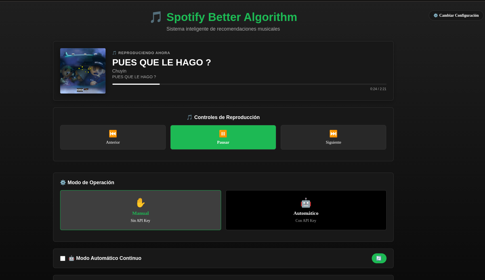

Un sistema inteligente de recomendaciones musicales que integra **Spotify** con **YouTube** usando **IA generativa** para descubrir nueva música automáticamente.

---

## ✨ Características Principales

### 🤖 **Triple Modo de Funcionamiento**
- **✋ Modo Manual**: El usuario limpia los títulos de YouTube manualmente (sin IA)
- **🤖 Modo IA Gemini**: IA de Google Gemini limpia títulos automáticamente (requiere API Key)
- **💻 Modo IA Local**: IA local con Ollama limpia títulos sin límites (gratis y privado)

### 🎯 **Recomendaciones Inteligentes**  
- **Scraping de YouTube** en tiempo real
- **20 sugerencias** de videos relacionados
- **Historial de reproducción** para evitar repeticiones
- **Agregado automático** a cola de Spotify

### 🎮 **Controles de Reproducción**
- ⏯️ **Play/Pause** desde el navegador
- ⏭️ **Siguiente/Anterior** track
- 🎵 **Información de track actual** en tiempo real

### 📱 **Acceso Remoto & WhatsApp**
- **Frontend responsive** accesible desde cualquier dispositivo
- **Scripts de automatización** para OpenClaw
- **Control desde WhatsApp** u otras apps móviles

---

## 📋 Requisitos del Sistema

### 🐍 Python 3.8+
```bash
pip install -r requirements.txt
```

### 📦 Node.js 16+ 
```bash
npm install
```

### 🌐 Navegador
- **Chromium/Chrome** (para Playwright scraping)
- **Conexión a internet** estable

### 🔑 Credenciales Spotify API
- **Client ID**
- **Client Secret** 
- **Redirect URI**

*Obtener desde: [Spotify Developer Dashboard](https://developer.spotify.com/dashboard)*

---

## 🚀 Instalación Rápida

### 1. 📥 Clonar Repositorio
```bash
git clone <repository-url>
cd Spotify_better_algorithm
```

### 2. 🔧 Configurar Backend
```bash
# Crear entorno virtual
python -m venv .venv

# Activar entorno (Linux/Mac)
source .venv/bin/activate

# Activar entorno (Windows)
.venv\Scripts\activate

# Instalar dependencias
pip install -r requirements.txt

# Instalar navegador para scraping
playwright install chromium
```

### 3. 🎨 Configurar Frontend
```bash
cd front
npm install
npm run build
cd ..
```

### 4. 🏃‍♂️ Iniciar Sistema
```bash
python run_server.py
```

**🌐 Acceder en:** `http://localhost:5173`

---

## 📖 Guía de Uso

### 1. 🔐 Configuración Inicial

Al abrir por primera vez, debes ingresar tus credenciales de Spotify:

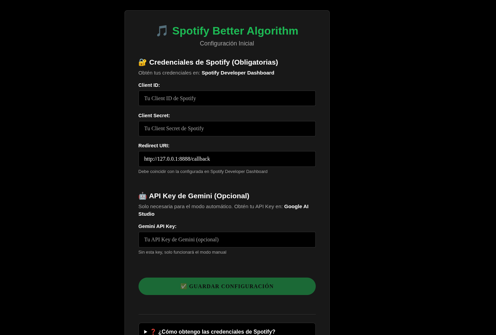

**Campos requeridos:**
- **Client ID**: Tu ID de aplicación Spotify
- **Client Secret**: Tu clave secreta de aplicación  
- **Redirect URI**: URI de redirección configurado (ej: `http://localhost:8888/callback`)

### 2. 🎮 Controles de Reproducción

Una vez configurado, tendrás acceso a controles completos:

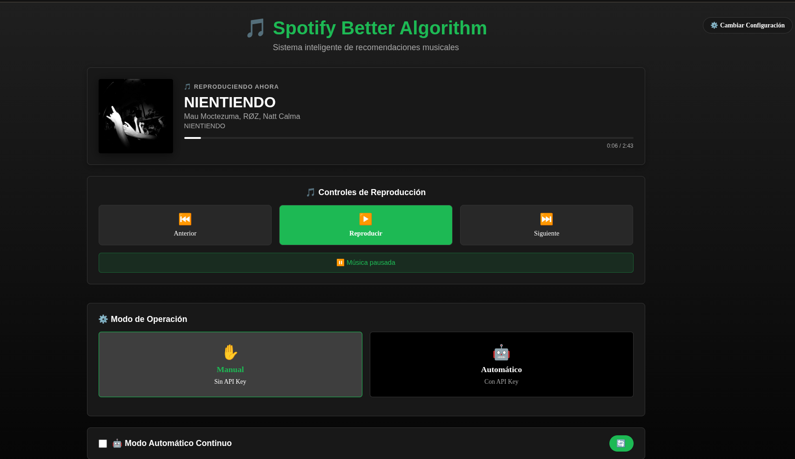


### 3. 🤖 Modos de IA

El sistema ofrece 3 modos diferentes para procesar títulos de YouTube:

#### ✋ Modo Manual
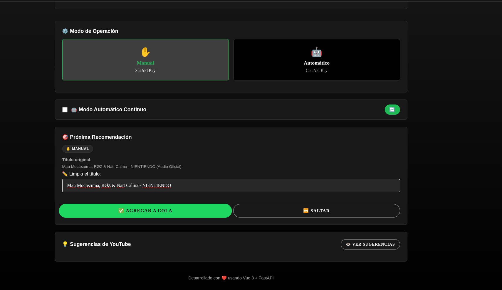

**Proceso manual:**
1. 🎯 **Título pre-cargado** en campo de texto
2. ✏️ **Editas** directamente en el input
3. 📤 **Envías** versión limpia
4. ✅ **Confirmación** de agregado

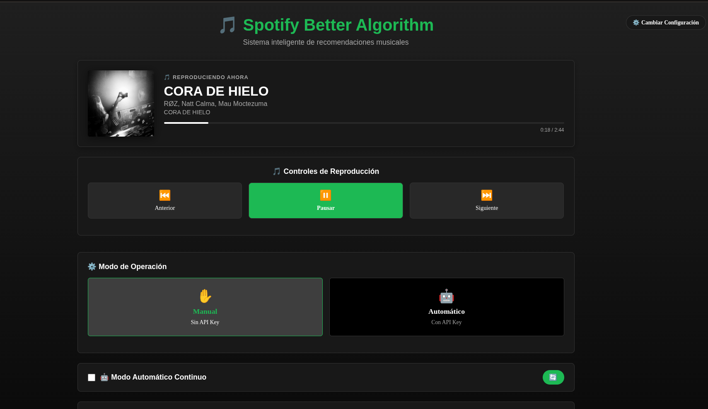
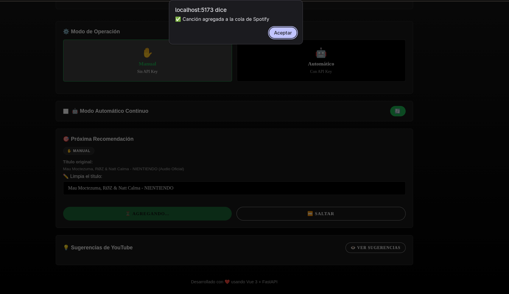

#### 🤖 Modo IA Gemini (Cloud)
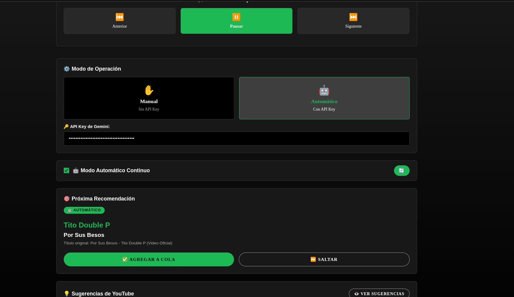

**Proceso automático con Gemini:**
1. ✅ **Detecta** canción actual en Spotify
2. 🔍 **Busca** en YouTube videos similares  
3. 🤖 **Limpia** título con IA Gemini (API de Google)
4. ➕ **Agrega** automáticamente a cola

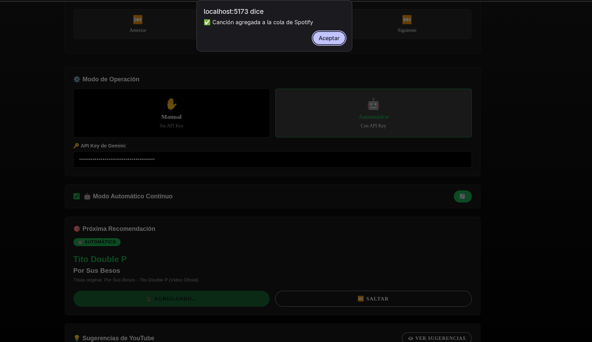

**Requisitos:**
- API Key de Google Gemini
- Cuota de API disponible

#### 💻 Modo IA Local (Ollama)

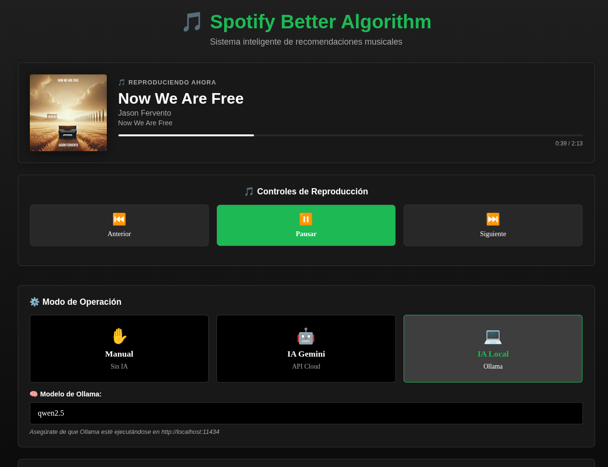

**Proceso automático con IA local:**
1. ✅ **Detecta** canción actual en Spotify
2. 🔍 **Busca** en YouTube videos similares  
3. 🤖 **Limpia** título con modelo local (Ollama)
4. ➕ **Agrega** automáticamente a cola

**Ventajas:**
- ✅ **Sin límites de cuota** - Procesa tantas canciones como quieras
- ✅ **Gratis** - No pagas por API
- ✅ **Privacidad** - Tus datos no salen de tu máquina
- ✅ **Offline** - Funciona sin internet (después de descargar el modelo)

**Instalación de Ollama:**
```bash
# Linux / macOS
curl -fsSL https://ollama.com/install.sh | sh

# Windows: Descargar desde https://ollama.com/download

# Descargar modelo recomendado
ollama pull qwen2.5
```

**Modelos recomendados:**
- `qwen2.5:1.5b` - Rápido, para CPUs modestos (~1GB)
- `qwen2.5` (7b) - Balance perfecto (~4GB) ⭐ **Recomendado**
- `qwen2.5:14b` - Máxima precisión (~8GB)
- `llama3.2` - Alternativa rápida

**Uso en la app:**
1. Asegúrate de que Ollama esté corriendo: `ollama serve`
2. Selecciona "💻 IA Local" en el selector de modo
3. Ingresa el nombre del modelo (por defecto: `qwen2.5`)
4. ¡Listo! La IA local procesará los títulos

### 4. 📝 Comparación de Modos

| Característica | ✋ Manual | 🤖 IA Gemini | 💻 IA Local |
|---------------|----------|--------------|-------------|
| **Costo** | Gratis | Pago según uso | Gratis |
| **Velocidad** | Lenta (humano) | Rápida | Media |
| **Precisión** | Alta (humano) | Muy alta | Alta |
| **Límites** | Sin límites | Cuota API | Sin límites |
| **Internet** | Necesario | Necesario | Opcional* |
| **Privacidad** | ✅ | ⚠️ (datos a Google) | ✅ |
| **Setup** | Ninguno | API Key | Instalar Ollama |
| **Recomendado para** | Usuarios sin prisa | Máxima calidad | Uso intensivo |

*Después de descargar el modelo

### 5. 🔍 Sugerencias de YouTube

Ve las 20 primeras sugerencias del video actual:

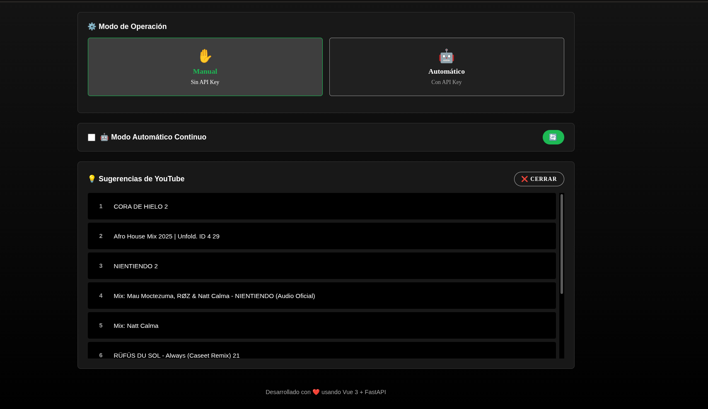

**Funciones:**
- 📋 **Lista completa** de sugerencias relacionadas
- 🎯 **Click para seleccionar** sugerencia específica
- 🔄 **Reemplaza** recomendación automática
- 🎵 **Integración directa** con Spotify

### 6. 🌐 Proceso de Scraping

El sistema abre Chromium automáticamente para scraping:

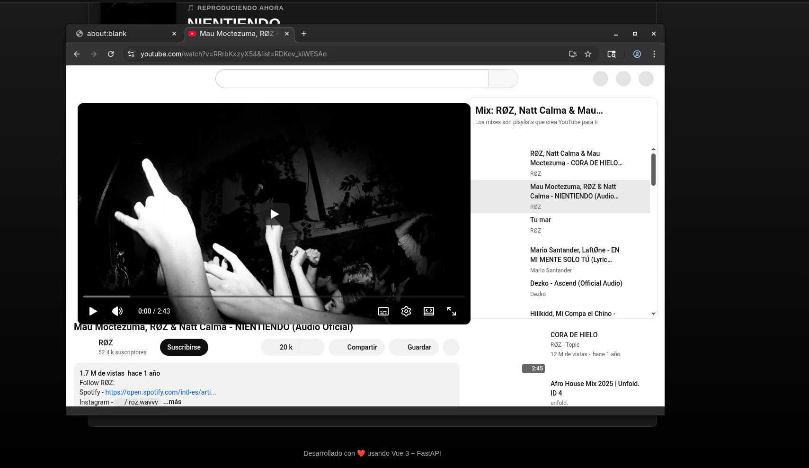

**Proceso interno:**
1. 🚀 **Abre** navegador Playwright
2. 🔗 **Navega** al video de YouTube actual
3. 🎯 **Busca** botón "siguiente" 
4. 📋 **Extrae** sugerencias y títulos
5. 🔒 **Cierra** navegador automáticamente

---

## ⚙️ Configuración Avanzada

### 🔑 API Keys

#### Spotify API
1. Ve a [Spotify Developer Dashboard](https://developer.spotify.com/dashboard)
2. Crea nueva aplicación
3. Copia `Client ID` y `Client Secret`
4. Agrega `Redirect URI`: `http://localhost:8888/callback`

#### Google Gemini (Opcional)
- Para modo automático con IA
- Obtener desde [Google AI Studio](https://aistudio.google.com)
- Configurar en el frontend cuando se solicite

### 🗄️ Base de Datos

El sistema usa SQLite para historial:
```
historial_canciones.db
├── songs (tracks agregadas)
├── recommendations (histórico)  
└── settings (configuraciones)
```

**Auto-limpieza:** La base se resetea al reiniciar el servidor

### 🌐 Configuración de Red

#### Acceso Local
- **URL**: `http://localhost:5173`
- **Solo desde la misma máquina**

#### Acceso en Red Local  
- **URL**: `http://[IP-de-tu-PC]:5173`
- **Desde cualquier dispositivo** en tu WiFi
- **Smartphone, tablet, otra PC**, etc.

---

## 📱 Automatización con OpenClaw (Uso desde WhatsApp)

### 🚀 Scripts de Automatización

Este sistema incluye scripts especiales en la carpeta `OpenClaw/` para automatizar el inicio desde **WhatsApp** u otras apps usando **OpenClaw**:

#### Windows: `OpenClaw/windows_start.bat`
- ✅ **Verificación automática** de Python y Node.js
- 🔧 **Instalación automática** de dependencias  
- 🌐 **Detección de IPs** de red local
- 📱 **Optimizado** para uso remoto

#### Linux: `OpenClaw/linux_start.sh`  
- 🎨 **Terminal colorizado** con estado claro
- 🐍 **Soporte Python3/Python** automático
- 🌐 **Múltiples interfaces** de red
- 🔧 **Instalación inteligente** de dependencias

### 📲 Configuración OpenClaw

1. **Instala OpenClaw** en tu móvil
2. **Configura comando**:
   - Nombre: "Spotify Better Algorithm"
   - Windows: `"C:\ruta\completa\OpenClaw\windows_start.bat"`
   - Linux: `bash /ruta/completa/OpenClaw/linux_start.sh`
   - Alias: "musica", "spotify", "music"

3. **Uso desde WhatsApp**:
   ```
   WhatsApp → OpenClaw: !musica
   OpenClaw → PC: Ejecuta script
   PC → Red: http://192.168.1.X:5173 disponible
   ```

### 🌐 Acceso Remoto

Una vez iniciado:
- 📱 **Desde móvil**: `http://IP-de-tu-PC:5173`
- 💻 **Desde otra PC**: `http://IP-de-tu-PC:5173`  
- 🏠 **En toda la casa**: Cualquier dispositivo en tu WiFi

### 🔒 Consideraciones de Seguridad

- ⚠️ **Solo usar en redes confiables** (casa, oficina)
- 🚫 **No exponer a internet** público
- 🔥 **Configurar firewall** apropiadamente  
- 📡 **Verificar** que puerto 5173 esté disponible

**Para más detalles**, consulta `OpenClaw/README.md`

---

## 🏗️ Arquitectura del Sistema

### 🔧 Backend (FastAPI)
```
api/
├── main.py                 # Aplicación principal
├── routes/                 # Endpoints API
│   ├── spotify.py         # Integración Spotify
│   ├── youtube.py         # Scraping YouTube  
│   └── recommendations.py # Motor recomendaciones
└── services/              # Lógica de negocio
    ├── youtube_scraper.py # Playwright scraping
    ├── title_cleaner.py   # Limpieza con IA
    └── recommendation_engine.py # Algoritmo recomendaciones
```

### 🎨 Frontend (Vue.js)
```
front/src/
├── components/            # Componentes modulares
│   ├── ConfigPage.vue    # Página configuración
│   ├── CurrentTrack.vue  # Info track actual
│   ├── PlaybackControls.vue # Controles reproducción
│   ├── ModeSelector.vue  # Selector modo manual/auto
│   ├── RecommendationCard.vue # Tarjeta recomendación
│   └── SuggestionsPanel.vue # Panel sugerencias
├── services/
│   └── api.ts            # Cliente API
└── types/
    └── index.ts          # Definiciones TypeScript
```

### 🗄️ Base de Datos
- **SQLite** local (`historial_canciones.db`)
- **Tablas**: songs, recommendations, settings
- **Persistencia**: Entre sesiones del servidor
- **Auto-cleanup**: Al iniciar servidor

---

## 🛠️ Troubleshooting

### ❌ "Error de credenciales Spotify"
1. Verifica Client ID y Client Secret
2. Asegúrate que Redirect URI coincide exactamente
3. Revisa que la app esté en modo "Development"

### ❌ "No se pueden cargar sugerencias"
1. Verificar conexión a internet
2. YouTube puede requerir CAPTCHA en primer uso
3. Reiniciar navegador Playwright: `playwright install chromium`

### ❌ "Error de IA Gemini"
1. Verificar API key de Google
2. Comprobar cuotas/límites en Google AI Studio  
3. El sistema funciona sin IA (modo manual)

### ❌ "No se puede acceder desde móvil"
1. PC y móvil deben estar en misma WiFi
2. Desactivar firewall temporalmente para probar
3. Usar IP mostrada por script (no localhost)
4. Puerto 5173 debe estar disponible

### ❌ "Canciones se repiten"
- El historial se resetea al reiniciar servidor
- Base de datos puede corromperse: eliminar `historial_canciones.db`

---

## 🔄 Actualizaciones y Contribuciones

### 📥 Actualizar Sistema
```bash
git pull origin main
pip install -r requirements.txt
cd front && npm install && npm run build
```

### 🐛 Reportar Bugs
- Incluir logs del servidor (`python run_server.py`)
- Especificar sistema operativo y versiones
- Describir pasos para reproducir

### 🚀 Nuevas Características
- Fork del repositorio
- Crear rama para nueva feature
- Pull request con descripción detallada

---

## 📄 Licencia

Este proyecto está bajo licencia MIT. Ver archivo `LICENSE` para más detalles.

---

## 🤝 Agradecimientos

- **Spotify API** - Integración musical
- **YouTube** - Fuente de recomendaciones  
- **Google Gemini** - Procesamiento IA
- **Playwright** - Web scraping confiable
- **FastAPI & Vue.js** - Framework web moderno

---

**🎶 ¡Disfruta descubriendo nueva música automáticamente! 🎵**

*Sistema creado con ❤️ para amantes de la música que quieren expandir sus horizontes musicales.*